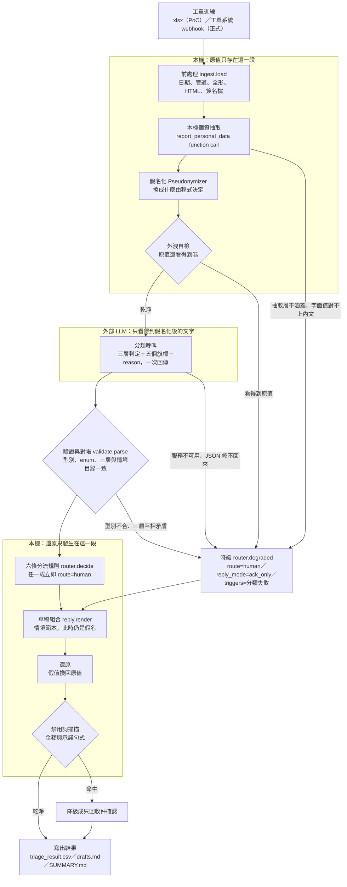

# T 旅遊客服工單分流：書面回答

第三部分的程式與說明在 `poc/`，執行方式見 `poc/README.md`。
語彙定義見 `CONTEXT.md`，幾個不明顯的決策與當初為什麼不選另一條路見 `docs/adr/`。

本文由 `docs/answers/` 的分稿組出，請勿直接編輯本檔。

---

# 第一部分：場景判斷與需求收斂

## Q1. 場景判斷

建議做 (B)，而且只做 (B) 的分流那一層加上不做承諾的範本草稿。(C) 的知識庫治理同時開工，但先治理文件、後做問答工具。(A) 不排期。

理由：(B) 是唯一不必等任何前置條件就能開始的做法，而且它直接壓低首次回覆時間。

### 三個構想的比較

| | (A) 全自動回覆 | (B) 分流加草稿由客服確認 | (C) 內部知識庫問答工具 |
|---|---|---|---|
| 直接改善什麼 | 首次回覆時間、人力 | 首次回覆時間、工單排序 | 單筆工單的查詢耗時 |
| 現在能不能做 | 不能 | 能 | 不能，文件還沒治理 |
| 錯誤的承受者 | 客戶 | 客服（送出前攔得住） | 客服（他知道要查證） |
| 卡在誰身上 | 法務、資訊部、知識庫三邊都卡 | 沒有硬阻擋 | 資訊部與文件擁有者 |

### (A) AI 直接自動回覆所有工單

**適用性**：只在「答案不需要查任何系統、也不會產生後果」的情境上成立。這 48 筆裡符合的只有兩類：廣告與詐騙、測試與無效內容，合計 2 筆（4%）。這兩類正確的處置是自動關單，不是回信。真正需要回覆的工單，八成以上不是動到訂單，就是要引用公司規定，兩者現在都沒有可信的資料來源。

**風險**：錯誤直接落在客戶身上，而且不可撤回。旅遊業的高風險句子非常短：「已為您辦理取消」「將於 3 個工作天退款」。這種句子一送出，公司就被綁住了，事後改口的成本比原本的客訴更高。第二層風險是它會吃掉客服對系統的信任。客服一旦開始繞過系統，後面所有的量測都失去意義。

**前置條件**：要簽約的 LLM 供應商、要接通的訂單系統 API、要有單一來源且標了版本的知識庫、要一段有客服複核的試營運資料證明草稿品質。四項全部到位之前，這個構想沒有討論的基礎。

### (B) AI 分流加草擬回覆，由客服確認後送出

**適用性**：現在就能做，而且打的是最痛的那個數字。首次回覆 6 小時、旺季 24 小時，這個數字的成因是「8 個人排隊讀信」，不是「回信寫太慢」。分流把排隊順序改對，再加上一封幾分鐘內就送出的範本回覆，首次回覆時間就會掉下來。這封範本說得出內容但不做承諾，回覆內容的責任仍然在人身上。

PoC 跑完 48 筆的結果支持這個判斷：34 筆（71%）轉真人、14 筆（29%）可自動處理。轉真人的那 34 筆裡，有 24 筆走的是「先送出範本回覆、工單仍然進人工佇列」，佔全部 48 筆的 50%。這 24 筆就是首次回覆時間下降的來源，它們一件都沒有被自動結案。

**風險**：三個，依嚴重度排列。

1. 客服變成橡皮圖章。草稿看起來很完整，複核就退化成按送出。這是題目 Q5 描述的情境，也是最需要在制度上防的。
2. 分流錯誤造成沉默的損失。一封寫得很糟的真實客訴被判成廣告然後自動關單，客戶收不到任何回應，公司也不知道發生過。PoC 對此的處置是：判為不受理的工單一樣要過六條分流規則。六條全部沒成立才自動關單，否則改成不回覆但進人工佇列。
3. 草稿內容空洞。沒有知識庫，範本只能講流程不能講規定，客戶收到會覺得是罐頭。這是接受的代價，換得的是零錯誤承諾。

**前置條件**：一個能在本機辨識個資的模型（見下方法務段落）、工單系統的 webhook 與回寫權限、一組由客服而非規則作者標註的驗證樣本。訂單 API 與知識庫不是開工的前提，它們決定草稿有多少資訊量，不決定分流能不能做。

### (C) 先做內部知識庫問答工具給客服自己查

**適用性**：方向正確，但現在做會做出一個很有自信的錯誤來源。資訊部窗口的原話是「散落在共用資料夾的 Word、Excel 和一個沒人維護的舊版 FAQ 網頁，版本很亂」。在這個狀態下接檢索，工具會用一樣的口氣引用去年的退費級距和現行的退費級距。客服讀不出哪一份是舊的。錯誤從「查不到」變成「查到錯的」，後者更難發現。

**風險**：知識庫問答的失敗模式是安靜的。查詢工具不會說「我引用的這份文件是 2024 年的」，它只會給出一段通順的答案。客服憑這段答案回信給客戶，錯誤就從內部工具流到了客戶身上。中間沒有任何一關會攔。

**前置條件**：文件治理先於檢索。要有單一來源、每份文件標了生效日與版本、有指定的維護人。這件事沒有 AI 的成分，是資訊部與各業務單位要做的事。治理做完之後，(C) 的實作成本很低，而且它同時讓 (B) 的草稿有內容可寫。

### 為什麼分流這一層要用 AI 而不是關鍵字規則

一個具體反例：TK-1011 是一封客訴信，客人在信裡罵「跟博弈網站一樣」。任何一張把「博弈」列為廣告關鍵字的規則表，都會把這封客訴判成廣告，然後照規則自動關單。這不是規則表寫得不夠好。關鍵字這個做法本身就分不出「寄件者在推銷博弈」和「寄件者拿博弈來罵你」。判準是寄件者的意圖，而意圖只存在於語境裡。

傳統機器學習則卡在另一件事：它需要標註資料，而這個案子開工時一筆都沒有。

代價：LLM 的輸出不穩定，`temperature` 壓到 0.1 之後同一封工單重跑仍可能得到不同的情境標籤。PoC 的處置是把六條分流規則全部放在程式端，模型只提供其中一項輸入。模型抖動會影響情境標籤，動不到「涉及發票一律轉真人」這種結論。

### 這些子問題不該用 AI 解，或不該現在解

| 子問題 | 為什麼不是 AI 的事 | 該怎麼解 |
|---|---|---|
| 退款超過 30,000 元要主管簽核 | 工單裡的金額是客戶自己打的字，不是系統值。拿它當簽核門檻，等於讓客戶自己決定要不要送簽核。少寫一個零就繞過了 | 程式規則：所有不可逆動作一律轉真人，金額只當記錄欄位輸出給人工參考 |
| 訂單系統的權限申請與 QPS 限制 | 這是行政流程與容量規劃。AI 不會讓審核變快，也不會讓 QPS 變高 | 現在就送申請，並在設計時假設 QPS 很低（快取加批次），不要假設它會放寬 |
| 知識文件版本混亂 | 這是文件治理，要指定維護人與生效日。用 AI 去猜哪一份是最新的，等於把治理債換個地方存放 | 單一來源加版本標記，人做，先於任何檢索 |
| 同一位客戶的重複來信合併 | 合併需要 thread id 或可靠的客戶識別。姓名在假名化之後不是可靠鍵。靠語意相似度猜，會把兩位不同客戶的信併在一起 | 請工單系統提供 thread id 或會員 ID。在那之前只在摘要裡點名，交人工判斷 |
| 「人力減半」 | 這是期望的結果，不是可以實作的需求。而且現在的瓶頸是跨系統查詢與等簽核，不是讀信。減半的目標訂在讀信上，打不中 | 先量出每一段耗時各佔多少，再談哪一段能省。試營運期間不動人力編制 |

### 推進順序

1. **第 1 到 4 週：做 (B) 的分流層。** 接工單系統 webhook，跑三層判定與六條分流規則，結果回寫工單系統的優先級與佇列欄位。這一段不送出任何客戶可見的內容，先讓客服看得到分流結果並且能標記分錯。理由：分流正確率是後面所有事情的地基，而它可以在完全不碰客戶的情況下先驗證。
2. **第 5 到 8 週：開啟範本草稿與自動收件確認。** 這時候才開始送出客戶可見的回覆，內容限定在不含金額、不含日期承諾的範本。首次回覆時間的改善在這一段才會出現。理由：把「分流對不對」和「回覆能不能送」分成兩個里程碑，任何一個出問題都知道是哪一段。
3. **同時進行，不等前兩步：知識庫治理。** 這是 (C) 的前置，由資訊部與業務單位主導，工程只提供格式與版本欄位的規格。理由：它的完成時間不在專案控制範圍內，越早開始越好。它同時是 (C) 和 (B) 草稿內容的前提。
4. **治理完成後：做 (C) 的問答工具。** 給客服自己查，不直接餵給客戶。理由：內部工具的錯誤有人接得住，是驗證檢索品質最便宜的場地。
5. **不排期：(A)。** 重新討論的條件是前三項數字同時成立，而不是時間到了。條件寫在 Q4 的晉級 Gate 裡。

---

## Q2. 問題定義書：AI 工單分流與草擬回覆

方向：Q1 的 (B)。這份文件拿去跟客服部、資訊部、法務對齊，每一條都應該能被指著問「這條做到了沒」。

### 目標

1. 每一封進線工單在 5 分鐘內被分到明確的服務情境，並標記它是可以自動處理還是必須轉真人。
2. 對可以先回的工單，送出一封不做任何承諾的範本回覆，把首次回覆時間的中位數往下壓。目前的基準是 6 小時、旺季 24 小時以上。目標值不在這裡訂，由 Q4 依試營運觀測到的分佈決定要不要當 Gate。
3. 對必須轉真人的工單，提供草稿與判斷依據，讓客服的處理時間縮短。
4. 客戶個資不離開本機邊界，且這件事由系統結構保證，不靠人員紀律。

### 非目標（out of scope）

1. **不做無人確認的內容回覆。** 唯一的例外是廣告詐騙與測試資料的自動關單，這兩類不送出任何文字。
2. **不做任何寫入動作。** 不執行退款、不改訂單、不開發票、不改帳號。系統只讀不寫。
3. **不做人力編制的調整。** 試營運期間 8 位客服維持不變。人力是後續依實際數字決定的事，不是這個專案的交付項。
4. **不做語音、電話、即時聊天。** 只處理 email 與網站表單這兩個文字管道。
5. **不做重複來信自動合併、不做金額門檻的自動簽核判斷。** 理由見 Q1。

### 使用者與使用情境

| 使用者 | 什麼時候會碰到這個系統 | 他要的是什麼 |
|---|---|---|
| 客服人員（8 位） | 每天開工單佇列時；處理單封工單時 | 佇列已經排好序、知道這封要查哪個系統、有一份可以改的草稿 |
| 客服部主管 | 每天看儀表板；每週看趨勢 | 積壓量、轉真人比例、首次回覆時間、哪些情境在變多 |
| 法務與資安 | 稽核時；有事件時 | 證明個資沒有離開本機的紀錄，以及外流時查得到範圍 |
| 資訊部 | 系統異常時；額度或 API 出問題時 | 降級發生了幾次、原因分佈、是不是打爆了誰的 API |
| 客戶 | 寄信之後 | 幾分鐘內收到一封說得出他問了什麼、但不亂承諾的回覆 |

### 輸入

來自工單系統 webhook，每封工單一筆：

| 欄位 | 說明 |
|---|---|
| `ticket_id` | 唯一識別 |
| `created_at` | 建立時間，正規化成台北時間 |
| `channel` | `email` 或 `form` |
| `customer_name` | 客戶姓名，本機假名化後才進入後續流程 |
| `subject` / `body` | 主旨與內文，前處理修掉 HTML 標籤、郵件簽名檔、全形英數字 |

### 輸出

回寫工單系統，並留下一份可稽核的紀錄：

| 欄位 | 允許值 | 用途 |
|---|---|---|
| `disposition` | `accept` / `reject` | 受理判定，這封工單要不要進客服流程 |
| `assignment` | `support` / `referral` / `not_applicable` | 承辦歸屬 |
| `scenarios` | 17 個服務情境，可複選 | 客戶要什麼；決定下游查哪個系統 |
| `route` | `auto` / `human` | 分流 |
| `reply_mode` | `none` / `template` / `ack_only` | 回覆型態，與分流正交 |
| `tools` | 情境群組對應的下游工具 | 標記要查什麼，第一階段只標不呼叫 |
| `is_complaint` / `is_irreversible` | 布林 | 分流規則的輸入 |
| `money_mentioned` | 字串，上限 100 字，多筆以頓號分隔，沒提到就是空字串 | 信中金額的原文照抄，只做記錄不參與判斷 |
| `residual_pii` | 字串陣列，上限 10 筆 | 假名化後仍看得到的個資片段；非空就轉真人 |
| `confidence` / `reason` | 0 到 1；文字 | 判斷依據，`reason` 保留假名不還原 |
| `draft` | 文字或空 | 草稿回覆，送出前已還原個資 |

`reply_mode` 與 `route` 是兩個獨立欄位，因為最重要的那個組合是「先送出範本回覆、工單仍然進人工」。只用 `route` 這個二值欄位，就分不出「AI 真的解決了」和「AI 只是回了個罐頭」。任務成功率也就算不出來。

### 資料與系統的前置條件

分成兩類：沒到位就不該開工的，和沒到位只是限縮範圍的。這個區分是刻意的。

**沒到位就不該開工**

| 前置條件 | 為什麼是硬條件 |
|---|---|
| 法務對「假名化後的文字送到未簽約服務」出具書面認可 | 這是整個方案的法律地基。法務的限制是客戶個資不得傳輸到未經評估與簽約的外部服務，而公司目前沒有任何簽約的 LLM 供應商。我們的答案是四步邊界：本機模型抽出個資、程式（不是模型）挑同型別的假值替換、只送假名化後的內容出去、回覆送出前才還原。假名對照表是處理過程中的區域變數，不寫檔、不進日誌、不進請求。送出去的資料結構裡沒有可以放原值的欄位。這個邊界成不成立要法務認，不是工程說了算 |
| 一個真的本機個資抽取模型，且量過漏抓率 | PoC 這一層是用人工標註模擬的，涵蓋範圍就是那 48 筆，第 49 筆會直接轉真人。正式流量不會有人先標好。漏抓率沒有數字之前，上面那條法律地基就只是寫在紙上 |
| 工單系統的 webhook 與回寫 API 存取權 | 沒有它只能離線批次跑，那不是試營運 |
| 一組由客服標註的驗證集，至少 200 筆，標註者不是寫規則的人 | 沒有它就沒有驗收基準。PoC 的 48/48 是同一個人寫定義又標註出來的。它證明定義夠明確、模型讀得懂，不證明分類對業務是對的 |

**沒到位只限縮範圍，不阻擋開工**

| 前置條件 | 沒有它會怎樣 |
|---|---|
| 訂單系統 REST API 權限與 QPS 配額 | 草稿裡不能出現任何訂單事實，只能講流程。分流照做 |
| 單一來源、標了版本的知識庫 | 範本只能講流程不能引用規定。客戶會覺得回覆偏空，但不會收到錯的規定 |
| 會員系統 API | 會員帳號情境全部轉真人，這 48 筆裡佔 2% |

### 可量化的驗收標準

每一條都寫了分子與分母，資料來源對應到 Q4 的量測點。試營運四週結束時逐條檢查。

**必要（沒過就不往前推）**

| 指標 | 分子 | 分母 | 門檻 |
|---|---|---|---|
| 個資外流事件 | 送到外部服務的請求裡含有真實個資的次數 | 送出的請求總數 | 0 |
| 殘留個資率 | 假名化後仍偵測到個資、因此轉真人的工單數 | 進線工單總數 | 這一條只看趨勢，數字上升代表抽取層在漏 |
| 錯誤承諾外送數 | 已送出的回覆裡含有金額、日期承諾或「已為您辦理」句式的封數 | 已送出的回覆總數 | 0 |
| 分流正確率（人工抽樣版） | 客服複核認同分流結果的工單數 | 當週被抽樣複核的工單數 | 每週抽 50 筆，連續四週不低於 90% |
| 沉默關單錯誤 | 自動關單之後被客服判定為真實客訴的工單數 | 自動關單的工單總數 | 0 |

**觀測（要有數字，門檻在 Q4 的 Gate 裡定）**

| 指標 | 分子 | 分母 |
|---|---|---|
| 任務成功率 | 系統送出範本回覆之後，客戶沒有再追問、客服也沒有補送內容就結案的工單數 | 當期 `reply_mode = template` 的工單數 |
| 首次回覆時間 | 工單建立到第一封回覆送出的時間，取中位數與 P90 | 當期有外送回覆的工單數（不含 `reply_mode = none` 那一批） |
| 人工接手率 | `route = human` 的工單數 | 進線工單總數。要拆成三種：規則接手（六條分流規則命中）、降級接手、繞過型接手 |
| 繞過型接手率 | 系統判 `auto` 或已產出草稿，但客服整份重寫或不使用草稿的工單數 | 系統產出草稿的工單總數 |
| 草稿採用率 | 原封不動送出，加上只做小幅修改（改動不超過草稿字數的三成）就送出的草稿數，兩者分開計 | 系統產出草稿的工單總數 |
| 降級率 | 因分類服務不可用、回應不合 schema、三層對帳矛盾、本機抽取層無法涵蓋、假名化後仍偵測到原值而轉真人的工單數 | 進線工單總數 |
| 客訴率 | 當期新增、且訴求指向本次回覆內容或處理過程的客訴工單數 | 當期進線工單總數 |
| 分流結果穩定度 | 固定回歸樣本每日重跑，旗標與情境標籤發生翻轉的筆數 | 回歸樣本總數 |

四點要與 Q4 對齊的定義，寫在這裡避免兩邊各算各的：

1. **草稿採用率與繞過型接手率是同一件事的兩端，所以「改寫」一定要拆。** 小幅修改（改動不超過三成字數）算採用，整份重寫算繞過。不拆的話，同一份被大改後送出的草稿，在採用率裡是成功、在繞過率裡也是失敗。兩個數字會同時變好又同時變壞。
2. **首次回覆時間的分母是有外送回覆的工單，不是全部進線工單。** 差的正是 `reply_mode = none` 那一批（不回覆自動關單，以及不回覆但進人工確認）。把它們算進去等於用「沒回信」去拉低平均回覆時間。
3. **分流正確率有兩個版本，不要混用。** 這份文件裡的那一條是人工抽樣版，每週 50 筆、由客服複核，量的是「分類對業務對不對」。Q4 的 Gate 用的是回歸集重跑版，同一份樣本跑 5 次取最差，量的是「模型穩不穩」。兩者門檻都是 90%，但分母不同，不能互相代替。
4. **分流結果穩定度我這裡寫的是翻轉筆數。** 如果 Q4 想要一個每日的一致率（與基準標註相符的比例），那要另外算，我這條不提供它。

模型輸出不穩定，`temperature` 壓到 0.1 之後同一封工單重跑仍可能不同。PoC 迭代中同一份標註對到的一致數走過 44、42、47、48。任何單次跑出來的百分比都不該當成穩定值，驗收看的是多次重跑的分佈。

### 開工前必問利害關係人的 5 個關鍵問題

**1. 給法務與資安：假名化之後的文字，在公司的認定裡還算不算個資？如果不算，這個結論要以什麼形式留存？**

想排除的風險：整個技術方案建立在一個未經確認的法律前提上。如果四週後法務說假名化不足以豁免，全部要重來。如果法務願意書面認可，設計就穩了。這題沒有答案之前寫的任何程式都可能作廢。

**2. 給資訊部：訂單系統 API 的權限審核實際要多久，核准後的 QPS 是多少？審核不過的話備案是什麼？**

想排除的風險：把專案排程建立在一個沒人承諾日期的審核上。另一半風險在 QPS：每天 350 件、旺季翻倍。如果核准的配額低於尖峰需求，架構要在設計階段就改成批次或快取，不能等到接的時候才發現。

**3. 給管理層：公司要不要評估並簽約 LLM 供應商？如果要，時程是多久；如果不簽，本機模型的硬體預算與運維由誰負責？**

想排除的風險：個資邊界的整套設計取決於這題的答案。簽了，設計可以簡化；永遠不簽，本機模型就是必要的長期投資而不是暫時的替代方案。兩種答案會導向不同的架構，現在的做法是先假設後者。

**4. 給資訊部與業務單位：知識文件的單一來源由誰負責維護？退費級距、簽證規定這類會變的內容，變更之後多久會反映到知識庫？**

想排除的風險：AI 用非常有把握的口氣引用過期規定。沒有指定的維護人就沒有時效保證。草稿內容只能永遠停在不引用規定的範本，(C) 也做不下去。這題問的其實是「誰的 KPI 裡有這件事」。

**5. 給客服部主管：試營運期間，每位客服每天願意花多少時間複核草稿和標記分錯？這件事算在他們的工作量裡還是額外的？**

想排除的風險：沒有回饋資料就沒有品質量測。如果標記分錯是「有空再做」，第三個月的模型漂移不會有人發現。第二層風險是複核退化成按送出，這正是題目 Q5 描述的情境。它的成因通常不是客服偷懶，是複核根本沒被算進工時。

---

# 第二部分：方案設計

## Q3. 端到端 Workflow 設計

設計的核心：**模型只負責看懂這封工單，程式負責決定要不要放行，人負責所有收不回來的動作。**

三層判定（受理判定、承辦歸屬、服務情境）、五個旗標（`is_complaint`、`is_irreversible`、`money_mentioned`、`residual_pii`、`confidence`）與一句 `reason`，由同一次 LLM 呼叫以單一 schema 產出。程式拿情境目錄核對它，再用六條規則決定分流。任何一步失敗都往同一個出口走：轉真人。

---

### 1. 任務流與資料流

順序不能換的地方有兩處。**個資在送出之前假名化**，所以抽取與假名化一定排在分類呼叫前面。**還原在寫出之前**，所以草稿是用假名組出來的，換回原值是寫檔前的最後一步。中間送出去的那一段，資料結構裡沒有可以放原值的欄位。

資料流有三個形態：

| 階段 | 內容 |
| --- | --- |
| 進線 | 原始工單，含原值 |
| 出本機 | 假名化文字，`prompt.ticket_text` 組出來的那一段 |
| 寫出去 | 分流結果加還原後的草稿 |

假名對照表是 `Pseudonymizer` 的實例屬性，處理完就隨實例消失，三個形態都不含它。

---

### 2. AI、規則、RAG、人工的分工邊界

| 角色 | 可以決定 | 不可以決定 |
| --- | --- | --- |
| **AI（外部 LLM）** | 這封工單在講什麼、屬於哪些服務情境、是不是客訴、訴求是否涉及不可逆動作、提到什麼金額、自評信心 | 分流結果、要不要回覆、回什麼字、假名換成什麼值、自己的答案算不算有效 |
| **規則（程式）** | 分流、回覆型態、優先級、假名的選值、回應是否通過驗證、什麼時候降級、草稿能不能送出 | 語意判斷。程式不做任何「這封工單在講什麼」的推論 |
| **RAG／知識庫** | 目前**沒有接**。將來只負責提供有出處的內容給草稿 | 分流。知識庫接上之後仍不參與任何 route 決策 |
| **人工** | 所有不可逆動作、所有客訴的實際回覆、判為不受理但有疑慮時要不要關單、以及每一筆 `route=human` 工單的最終送出 | 無限制。人工是唯一有權執行收不回來的動作的角色 |

**模型填三層，程式核對三層。** 比較安全的做法是讓模型只選情境、受理判定與承辦歸屬由程式查表填，那樣永遠不會矛盾。我們刻意不這樣做：模型把一封博弈廣告判成「受理／客服」卻選了 `spam_fraud`，這個矛盾本身就是「它這次沒讀懂」的訊號。查表會把訊號抹掉，留下一個看起來很乾淨的錯答案（ADR 0003）。對帳矛盾直接當分類失敗轉真人，不修補。

**RAG 現在是空的，這是誠實的空。** 資訊部說知識文件散在共用資料夾的 Word、Excel 和一個沒人維護的舊 FAQ 網頁，版本很亂。在版本混亂的來源上做檢索，等於讓 AI 引用一份沒人知道對不對的規定。PoC 的草稿內容是情境範本，是模擬的，不是任何旅行社的真實規定。接上知識庫時只換掉草稿的內容來源：情境群組已經在 `catalog.py` 標好 `kb_search`，接線點是既有的。

**下游系統目前只標記不呼叫。** 情境群組決定這封工單下游要查什麼：訂單 API、知識庫檢索、會員 API、工單系統轉單。CSV 的 `tools` 欄把它寫出來，但 PoC 不呼叫任何一個。訂單系統的 API 權限在開工時還沒核准。

---

### 3. 人工接手的觸發條件

**六條規則，全部在程式端判斷，任一成立就轉真人。** 沒有加權、沒有分數合成。要能對客服解釋「這封工單為什麼進你的佇列」，答案必須是一條可以指著看的規則。

| # | 規則 | 判斷依據 | 在防什麼 |
| --- | --- | --- | --- |
| 1 | 情境需人工 | 該情境在情境目錄登記 `requires_human` | 這類事情本質上要查系統或要判斷，回罐頭等於沒回 |
| 2 | 客訴性質 | 模型判定這封工單在責難本公司 | 客訴用範本回覆會把一件小事變成負評 |
| 3 | 非客服來信 | 承辦歸屬是 `referral` | 供應商報價、應徵、業配、媒體採訪被當客戶回覆 |
| 4 | 不可逆動作 | 情境登記 `irreversible`，或模型判定訴求涉及退款、開立文件、變更帳號、在既有訂單上加購或變更 | 系統執行了收不回來的動作 |
| 5 | 殘留個資 | 模型回報文字裡還看得到個資，扣掉我們自己放進去的假名之後仍有剩 | 抽取層漏抓，個資跟著往下游走 |
| 6 | 信心不足 | `confidence` 低於 0.6 | 模型自己都不確定的判斷被當成結論用 |

**四種降級路徑，一律轉真人，不退回關鍵字比對。**

| 降級原因 | 觸發點 | 在防什麼 |
| --- | --- | --- |
| 本機抽取層無法涵蓋 | `pii.ExtractionUnavailable`：這封工單不在標註範圍，或回報的字面值在內文裡找不到 | 沒假名化的內容被送出去 |
| 假名化後仍看得到原值 | `Pseudonymizer.leaked()`，送出之前的自我檢查 | 替換沒生效卻照樣送出 |
| 分類服務不可用 | `ClassifierUnavailable`：重試耗盡、JSON 修不回來、重跑的回應與現在的模型或 prompt 版本對不上 | 拿舊答案或空值假裝跑過 |
| 回應不合約定 | `InvalidAnswer`：型別錯、值不在 schema 的 `enum` 內、`confidence` 超出範圍、三層與情境目錄對帳矛盾 | 一個格式正確但內容矛盾的答案被當成結論 |

**判為不受理的工單也要過同一組規則。** 自動關單是這條管線唯一會讓工單消失的動作，所以只有六條全部沒成立才做。任一條成立就改成不回覆、但進人工佇列。人要確認它真的是廣告，而不是一封寫得很糟的真實客訴（ADR 0004）。

**禁用詞是第七道關卡，但它降級的是回覆型態不是分流。** 草稿寫出前掃一次金額數字與承諾句式（「已為您辦理」「將於 X 日」「同意退款」），命中就把 `template` 降成 `ack_only`。這條放在程式不在 prompt。「不亂承諾」的失敗成本是客訴，不能建立在模型每次都聽話的假設上。

**金額不參與分流決策。** 資深客服說「退款金額超過 30,000 元一定要主管簽核」。直覺會想加一條金額門檻，我們刻意不加（ADR 0002）。工單裡的金額是客戶自己打的字，不是系統值。拿它當門檻等於讓客戶自己決定要不要送簽核：少寫一個零就繞過了。而且客戶提到的數字經常不是本次交易金額，可能是他記錯的團費、是求償金額、是兩筆扣款通知的差額。真正的金額只有訂單系統知道，而訂單 API 的權限還沒下來。所以改成**所有不可逆動作一律轉真人**，金額只寫進 `money_mentioned` 欄供人工參考。代價是自動處理率明顯偏低，這是誠實的低。在拿不到權威金額之前，任何以金額為條件的規則都是把安全性建立在客戶的誠實上。

---

### 4. 錯誤處理與降級策略

**原則：便宜的修法先做，修不好就轉真人，絕不猜。** 降級的方向永遠是「交給人」，不是「換一個比較笨的自動判斷」。

| 失敗型態 | 系統怎麼辦 | 為什麼這樣做 |
| --- | --- | --- |
| 傳輸層錯誤（連線失敗、5xx、逾時） | 最多 3 次，間隔 1 秒、3 秒。耗盡就降級 | 一律視為暫時性。分不出來的錯誤重試比放行安全 |
| 額度用完（429） | 讀回應裡的 `RetryInfo.retryDelay` 等，等完清空節流視窗，**不計入重試次數**，最多等 2 次 | 額度是排隊不是錯誤。判斷依據是狀態碼與結構化欄位，不是錯誤訊息的字面內容 |
| 回應不是合法 JSON | 先用程式修：從最右邊的 `}` 往左切，每個候選都跑一次 schema 驗證。修不出來才呼叫 LLM 重出格式，最多 3 次，共用同一個驗收標準 | 程式修不花額度。驗證才是驗收標準，光是 `json.loads` 成功不算，半截的前綴也可能是合法 JSON 但欄位不全 |
| 模型鎖進重複輸出 | `max_output_tokens=800` 硬上限，`temperature=0.1` | 實際踩過：完全的 greedy decoding 讓模型鎖進重複輸出的迴圈，回了 65KB 的壞 JSON。正常回應約 140 token，給硬上限讓失控的那次快速失敗 |
| 回應合法但不合約定 | `validate.parse` 拋例外，降級轉真人，不修補任何欄位 | 三層互相矛盾代表這次判斷不可信，不是一個可以直接修好的欄位 |
| 沒有金鑰或需要重跑 | 讀既有回應檔，`model`、`prompt_version`、`input_digest` 三者必須全部一致，否則拋例外降級 | 少了這些檢查，改過 prompt 之後重跑會拿舊答案當新答案用，而且完全看不出來 |

**降級不會退回關鍵字比對。** 關鍵字表的錯誤是靜默的：TK-1011 是一封客訴信，客人在罵「跟博弈網站一樣」。關鍵字表會把它判成廣告然後自動關單，而這是這條管線唯一會讓工單消失的動作。轉真人的錯誤只是多花一個人的時間，關鍵字的錯誤是把客訴刪掉。兩者不是同一個量級。

**LLM 完全掛掉的那一天**，這套系統退化成「全部轉真人，每封工單送出一則收件確認」。8 位客服的處理量回到現況，但首次回覆時間不會回到 6 小時。收件確認仍然在幾分鐘內發出。這是刻意設計的最壞情況：系統壞掉時，它壞成一個工單分派器，不壞成一個亂回信的機器人。

---

### 5. 個資與權限邊界

**法務的限制是「客戶個資不得傳輸到未經評估與簽約的外部服務」，而分類要用外部 LLM。解法是讓送出去的請求裡沒有可以放原值的欄位。**

四步，順序不能換（ADR 0001）：

1. **本機抽取。** 本機模型透過一次 function call（`report_personal_data`）回報「語意型別 + 原文字面值」。PoC 沒有本機模型，用人工標註模擬這個回應，但走的是完全相同的驗證路徑（`parse_tool_call`）。正式環境把 transport 換成真的 HTTP 呼叫，其餘程式不動。標註沒涵蓋、或回報的字面值在內文裡找不到，一律拋例外轉真人。
2. **程式挑假名。** 換成什麼完全由程式決定，不交給模型。程式看原值的字形挑替換方式：全大寫拼音換護照式拼音、大小寫英文換英文名、中文帶稱謂只換姓保留稱謂（陳先生換成王先生）、簡稱保留簡稱（小陳換成小李）、公司保留業別與組織型態（XX 巴士公司換成範例巴士公司）。拿掉的是身分，留下的是分類需要的線索。
3. **只送假名化後的內容。** 假名對照表是處理過程中的區域變數，不寫檔、不進日誌、不進請求。送出之前還有一道自我檢查：原值如果還出現在要送出的文字裡，這封工單根本不送，直接降級。
4. **寫出前還原。** 草稿用假名組好才換回原值。CSV 的 `reason` 欄保留假名，只有 `drafts.md` 還原。

**為什麼這是結構上的保證而不是紀律上的承諾。** 送給外部服務的資料結構裡沒有可以放原值的欄位：`prompt.ticket_text()` 每一個承載工單文字的參數（寄件者、主旨、內文）都是 `Pseudonymizer.apply()` 的輸出。另外兩個參數是工單編號與來源管道，兩者都不是個資。要讓原值外流，得先改掉這個函式的呼叫端，那是一個看得見的 diff，不是一次疏忽。

**為什麼用假名而不是 `<PII_NAME_1>` 佔位符。** 佔位符更安全，但會傷到分類品質：客訴性質是靠語氣判斷的，「`<PII_NAME_1>` 您好，我想取消 `<PII_DATE_1>` 的行程」比一段自然的中文更難判斷訴求。假值一律用「王小明／王小美／範例公司」這種一看就知道是假的值，不自己編看起來很真的名字。值之間的相似關係也保留：TK-1028 的兩個護照英文名只差一個字母、TK-1010 的錯誤與正確統編只差最後一碼。換成兩個不相干的假值，等於在假名化的時候把客戶真正的問題消滅掉。

**權限邊界。** 情境群組決定這封工單下游該查哪個系統，目前只標記在 CSV 的 `tools` 欄，不呼叫。接上真系統時的分界線是：`route=auto` 的工單只允許唯讀查詢（訂單狀態、知識庫檢索），所有寫入動作（送退款申請、變更訂單、變更帳號）只出現在人工介面上。系統本身不持有可以寫入的憑證。這條和第 4 條分流規則是同一件事的兩面：不可逆動作既不自動執行，也不給系統執行它的權限。

**一個誠實的缺口。** 存下來的回應檔存的是 `input_digest` 不是原文，所以檔案裡沒有工單內容。唯一的例外是模型回報的 `residual_pii` 欄位，它原樣寫進檔案，而且**48 個回應檔裡有 29 個這一欄不是空的**。寫進去的內容是我們自己放的假名：TK-1023 那一筆是 `["劉小美","B123456780","0900000001","001-000000000001"]`，四個值全部出自 `pii.py` 的假值池。`pipeline.py` 用 `masked.covers()` 扣掉之後，真正的殘留個資是 0 件，第 5 條規則一次都沒被觸發。

問題在於這個欄位的寫入路徑不分真假：模型回報什麼就寫什麼。抽取層哪天真的漏抓一筆，那個片段會沿著同一條路徑寫進檔案，而且不會有任何訊號。接真流量前必須把它改成只寫型別不寫值，做法和 `Pseudonymizer.leaked()` 一樣。這件事比「殘留個資 0 件」這個數字給人的印象更急：那個 0 是過濾器擋下來的結果，不是這一欄本來就乾淨。

---

### 6. Log 與追蹤點

**記錄的位置有三個，各自回答不同的問題。**

| 位置 | 記什麼 | 之後可以回答什麼 | 餵給哪一類指標 |
| --- | --- | --- | --- |
| `data/responses/<ticket_id>.json` 每封工單一個檔 | `model`、`prompt_version`、`input_digest`、input／output token 數、模型的完整原始回應 | 「這一筆當初為什麼被這樣分？」「這個結果是哪個 prompt 版本跑的？」「一封工單花多少 token？」 | 成本、版本歸因（任何指標都要能按 prompt 版本切開看） |
| `triage_result.csv` 每封工單一列 | `route`、`reply_mode`、`priority`、`triggers`、`scenarios`、`confidence`、`is_complaint`、`tools`、`pii_count`、`banned_hits`、`money_mentioned`、`reason` | 「哪些工單轉了真人、是被哪一條規則轉的？」「回了範本還是只回收件確認？」「哪些草稿被禁用詞攔下來？」 | 人工接手率、任務成功率的分母切分、錯誤率、防護型指標 |
| `SUMMARY.md` 每次執行一份 | 情境分佈、群組分佈、分流分佈、回覆型態分佈、各條觸發規則的命中數、前處理修掉的雜訊筆數、疑似重複來信、禁用詞攔截件數 | 「這一批的整體樣貌和上一批比有沒有漂移？」 | 批次層級的比較基準 |

**每一個紀錄點的設計理由。**

1. **`triggers` 欄是複數，記全部命中的規則不是第一條。** 只記第一條的話，永遠看不出來六條規則裡有幾條是白寫的。48 筆的實際結果是：轉真人的 34 筆全部命中「情境需人工」，其他五條沒有一筆單獨生效。這個事實只有在 `triggers` 記全部時才看得到，它說明其他五條是多層防護不是獨立來源。
2. **`reason` 欄同時記程式的判斷和模型的一句話。** 格式是「轉真人（觸發的規則）。模型對這封工單的理解」。客服看到這封工單在自己的佇列裡時，一行就知道是誰、要什麼、以及為什麼是他來處理。
3. **只記 `input_digest`，不記輸入原文。** 回應檔要能證明「這個答案對應的是這段內容」，但不需要把內容再存一份。digest 做得到前者，做不到後者，所以選它。
4. **`banned_hits` 欄記命中的字串。** 它是唯一能回答「模型有多常想亂承諾」的資料。這一欄如果開始上升，代表 prompt 或模型換版之後行為漂移了，而且是往客訴的方向漂。
5. **刻意不記的東西：假名對照表、任何個資原值。** 降級訊息也只寫型別不寫值（「假名化後仍偵測到 person_name 的原值」），因為那句話會進 CSV 的 `reason` 欄，寫原值等於把個資寫進檔案。

**待補的紀錄點，三個。** 回應檔目前只有六個鍵：`ticket_id`、`model`、`prompt_version`、`input_digest`、`usage`、`answer`。下面這三件事現在沒有任何地方記，Q4 要算的指標有一部分建立在它們上面，所以要在試營運開始前補完。

| 待補的紀錄點 | 現在為什麼算不出來 | 補了之後可以算什麼 |
| --- | --- | --- |
| 時間戳 | 回應檔沒有呼叫的開始與結束時間，CSV 也沒有處理時間欄。工單的 `created_at` 有記，缺的是另一端 | 單封工單處理時間、端到端首次回覆時間。要補三個點：工單進線、草稿產出、真人送出。前兩個由這條管線寫，第三個要從工單系統的 API 取 |
| 重試與節流等待 | `gemini.py` 的重試次數、429 的等待秒數、節流器讓出的時間都只發生在記憶體裡，沒有寫出去 | 每封工單實際等了多久、額度是不是瓶頸。旺季翻倍時這是第一個會撞到的東西 |
| 降級事件 | 降級目前只在 CSV 的 `triggers` 欄留下「分類失敗」，原因寫在 `reason` 欄的自由文字裡。而且**分類呼叫之前就降級的兩條路徑（抽取層未涵蓋、假名化後仍看得到原值）根本不會產生回應檔** | 降級率、以及降級是由哪一條路徑造成的。現在要回答「這週有幾筆是抽取層擋下來的」只能用字串比對 `reason` 欄 |

時間戳這件事必須排第一：首次回覆時間從 6 小時降到多少是這個案子的主要賣點，沒有那三個時間戳就沒有數字。

---

*指標的分子分母、資料來源與上線 Gate 見 Q4。*

---

## Q4. 指標與上線 Gate

### 三個讀數字的前提

這三個前提沒有先講清楚，後面每一個百分比都會被誤讀。

**一、PoC 的 48/48 不是準確率。** 它是「模型的判斷，和一位標註者對同一份定義的理解，48 筆全對得上」。那位標註者同時是寫 prompt 的人，樣本只有 48 筆。

它能證明的：情境定義寫得夠明確，模型讀得懂，同一份規則兩邊解讀不會分岔。這是分類體系的品質證明。

它不能證明的：這個分類對業務是對的。定義本身可能就把某類工單歸錯了，寫定義的人和標註的人是同一個，這個錯不會被抓到。

要量真正的準確率，三個條件缺一不可：

1. 標註者是客服人員，不是寫規則的人
2. 樣本是真實工單，不是這 48 筆
3. 標註在看到模型輸出之前完成，避免被模型答案帶著走

在這三件事做完之前，任何「準確率」都不該寫進簡報。試營運的第一週就是拿來補這件事的。

**二、單次跑出來的百分比不是穩定值。** 同一份工單、同一份標註，PoC 迭代過程中量到的一致數依序是 44、42、47、48（分母都是 48）。`temperature` 已經壓到 0.1，Gemini 在低 `temperature` 下仍非決定性。

`temperature` 不設 0 是刻意的取捨，不是漏設。完全的 greedy decoding 會讓模型有機會鎖進重複輸出的迴圈。PoC 實際發生過一次，回了 65KB 的壞 JSON。設 0.1 足以跳出來，代價是重跑的差異略增。**所以這裡的不穩定有兩個來源：一部分是模型本身就有的，一部分是為了穩健性刻意換來的。兩者都不會消失。** Gate 只能建在多次重跑上，不管是哪一種來源。

擺盪幅度到 6 筆，等於 12.5 個百分點。一個寫成「分流正確率 95% 才放行」的 Gate，用單次量測會在 42 那次直接不過、在 48 那次輕鬆過。系統完全沒有改變。這種 Gate 量的是運氣。

而且翻轉發生在最貴的位置：TK-1009（指定郵輪艙位）與 TK-1045（加購托運行李）在兩次跑之間從 `human` 翻成 `auto` 又翻回來。翻的是 auto 與 human 的邊界，不是無關緊要的標籤。

**Gate 要這樣建，取代單次百分比：**

| 做法 | 內容 |
|---|---|
| 固定回歸集 | 從真實工單抽一批，由非寫規則者標註後凍結。改 prompt、換模型版本、供應商改版，都跑同一份 |
| 重跑 K 次 | K 等於 5（建議值）。PoC 免費層每分鐘 15 次，48 筆跑 5 次約 16 分鐘，成本不是問題 |
| 看三個數，不看平均 | 最差一次的分流正確率；分流翻轉率；旗標翻轉率 |
| Gate 掛在最差值 | 通過條件寫「K 次裡最差的那次也要達標」，不是「K 次平均達標」 |
| 翻轉率單獨設上限 | 翻轉率本身就是一個要 Gate 的指標，見下方 M6 |

**三、PoC 的人工接手率 71% 是缺系統，不是模型弱。** 34 筆轉真人，34 筆全部命中「情境需人工」這一條。其餘五條規則沒有一筆是單獨生效的：不可逆動作命中 24 筆、客訴性質 10 筆、非客服來信 5 筆，全都疊在已經因情境轉真人的工單上。**殘留個資 0 筆、信心不足 0 筆**。

也就是說，沒有任何一封工單是因為「模型不確定」或「個資沒清乾淨」才轉人工的。接手率高，是因為那些情境在情境目錄裡登記了 `requires_human`。登記的理由是回答它需要查訂單系統或知識庫，而這兩個系統都還沒接。

能不能降下來，取決於訂單 API 與知識庫接上之後，有多少情境可以把 `requires_human` 拿掉。這 48 筆的情境群組分佈：

| 情境群組 | 佔比 |
|---|---|
| 訂單查詢 | 38% |
| 知識查詢 | 27% |
| 不查系統 | 19% |
| 轉其他單位 | 10% |
| 不受理 | 4% |
| 會員系統 | 2% |

前兩個群組合計 65%，正好就是缺系統的那兩塊。

**這不等於接上系統就能自動化 65%。** 其中的不可逆動作（退款、變更訂單、開立文件、變更帳號）不論有沒有系統都要轉真人，PoC 裡命中 24 筆。實際能降多少是試營運要量的第一件事，現在推不出數字。

---

### 試營運監控指標

六項主要指標，加下一節的四項防護型指標。M1 到 M5 對應題目要求的四類（成功率、接手率、錯誤率、處理時間）加上分流品質，M6 是跨天穩定度。

**其中一半現在算不出來，這件事直接寫在每個指標的來源欄裡。** Q3 定義的紀錄點只有三處（存下來的回應檔、`triage_result.csv`、`SUMMARY.md`），而且 Q3 自己已經點名缺時間戳。哪些現在就能算、哪些要等紀錄點補上，整理在下方「這些指標需要的紀錄點」。

#### M1 分流正確率（分類做對了沒有）

| 項目 | 定義 |
|---|---|
| 分子 | 抽樣複核中，人工判定分流結果正確的工單數 |
| 分母 | 該週抽樣複核的工單數 |
| 來源 | 分母來自 `triage_result.csv` 寫出的紀錄（隨機抽樣）；分子來自客服主管在工單系統自訂欄位上的複核結果 |
| 頻率 | 每週抽 50 筆（建議值），日流量 350 件下約佔 2% |
| PoC 現值 | 沒有。48/48 是與寫規則者的一致度，見上方前提一 |

配一個被動回報作為交叉檢查：**分錯回報率**。分子是客服在工單上按下「這封分錯了」的件數，分母是當期完成分類的工單總數。來源是工單系統的自訂欄位與 webhook。被動回報一定低估（沒人標不等於沒錯），所以它只能用來抓突發劣化，不能當通過條件。

#### M2 任務成功率（自動處理的案子真的結掉了沒有）

| 項目 | 定義 |
|---|---|
| 分子 | `route=auto` 且已結案的工單中，送出回覆後 14 天內沒有被重開、沒有被客服事後改判、也沒有衍生新客訴的件數 |
| 分母 | 當期 `route=auto` 且已結案的工單數 |
| 來源 | 分母來自 `triage_result.csv` 的 `route` 欄；分子來自工單系統 webhook 的重開事件與新工單事件（用 thread id 關聯，不用客戶姓名，姓名已假名化不是可靠鍵）加上客服的事後改判標記 |
| PoC 現值 | 沒有。PoC 的 14 筆 `auto` 沒有真實客戶回饋，成功與否量不到 |

`auto` 的分母要拆成兩塊看，因為兩者的失敗成本差一個數量級：

- **`template` + `auto`**：送出情境範本並結案。失敗是回錯內容，客戶會回信
- **`none` + `auto`**：不回覆直接自動關單。失敗是誤殺，客戶不會回信，見下方防護型指標

#### M3 人工接手率（拆成三種，混在一起看會看錯）

分母都一樣：當期進入管線的工單總數，來源是工單系統 webhook 的建單事件。

| 類型 | 分子 | 來源 | 這個數字代表什麼 |
|---|---|---|---|
| 規則接手率 | 六條分流規則命中而 `route=human` 的工單數 | `triage_result.csv` 的 `route` 與 `triggers` 欄（`triggers` 是機器可讀的管線分隔清單，`reason` 是寫給人看的句子，不要拿去算） | 設計要的結果，不是故障。PoC 是 71%。**現在就算得出來** |
| 降級接手率 | 五條降級路徑任一命中而轉真人的工單數：分類服務不可用、回應不合 schema、三層對帳矛盾、本機抽取層無法涵蓋、假名化後仍偵測到原值 | CSV 的 `triggers` 欄值為「分類失敗」的列數，加上一個要新增的降級事件紀錄 | 這是故障。它上升代表模型或供應商出事，要獨立告警。**總數算得出來，分不出是哪一條** |
| 繞過型接手率 | `route=auto` 或草稿已產出，但客服自行改寫或丟棄後重寫的工單數 | 工單系統上草稿的採用狀態（採用／改寫／丟棄） | 信任指標。系統說可以自動，人不用，這是最早的預警。**紀錄點還沒有** |

繞過型接手率是三種裡最重要的一個。前兩種在數字上看得見，第三種會偽裝成「接手率正常回升」。Q5 描述的「客服開始不信任、幾乎全面改走人工」就是這一項在動，而規則接手率完全沒變。沒有草稿採用狀態這個紀錄點，這件事要等到有人抱怨才會被發現。

**草稿採用率**（Gate 2 與退場條件都會用到，先定義清楚）：分子是客服未修改或僅小幅修改就送出的草稿數，分母是系統產出草稿的工單總數。來源同樣是工單系統上草稿的採用狀態。它跟繞過型接手率是同一份資料的兩面，採用率下降就是繞過率上升。「小幅修改」的界線要在試營運開始前跟客服主管談定，並寫進工單系統的選項。不要留給每個人自己判斷。

**降級的五條路徑在 CSV 裡分不開。** `router.degraded()` 把五條全部寫成同一個 `triggers` 值「分類失敗」，所以算得出降級總數，算不出是哪一條在漏。而且其中兩條（抽取層無法涵蓋、假名化後仍偵測到原值）在模型被呼叫之前就 return 了，連回應檔都不會產生。回應檔對這兩條完全沒有紀錄。這是要請 Q3 補的降級事件紀錄點：記原因與工單編號，不記個資原值。

搭配一個拆解用的診斷數字：**規則排他命中數**。分子是「只有這一條規則成立、其他五條都不成立」的工單數，分母是 `route=human` 的工單數。來源是 CSV 的 `triggers` 欄（管線分隔，記全部命中的規則不是第一條，所以排他性算得出來）。它回答的是「補哪個系統能真的降低接手率」。PoC 的答案很乾淨：除了情境需人工，其餘五條的排他命中數都是 0。

#### M4 錯誤率（拆成系統錯與內容錯）

| 類型 | 分子 | 分母 | 來源 |
|---|---|---|---|
| 系統錯誤率 | 五條降級路徑的事件數：分類服務不可用、回應不合 schema（含 JSON 修不出來）、三層對帳矛盾、本機抽取層無法涵蓋、假名化後仍偵測到原值 | 當期進入管線的工單數 | CSV 的 `triggers` 欄「分類失敗」的列數，加上待補的降級事件紀錄。存下來的回應檔（模型代號、prompt 版本、input digest、token 用量）只能歸因前三條 |
| 內容錯誤率 | 已送出的回覆中，事後被認定內容錯誤的件數：承諾了做不到的事、事實寫錯、回錯對象 | 當期已送出的回覆總數（含 `template` 走 `auto` 與走 `human` 兩種） | 客訴工單回溯、客服的「草稿不能用」標記、主管每週抽樣複核 |

**系統錯誤率的分母刻意用工單數，不用呼叫次數。** 呼叫次數現在沒有任何地方在記：回應檔是一封工單一個檔，重試與修 JSON 的額外呼叫不會多產生一個檔。要用呼叫次數當分母，得先在回應檔裡加一個呼叫計數欄，那是另一件事。工單數從 CSV 的列數就拿得到，現在就能算。

**內容錯誤率的分子是人的判斷，所以配一個機器算得出來的：禁用詞攔截率。** 分子是 `triage_result.csv` 的 `banned_hits` 欄非空的列數，分母是有產出草稿的列數（`reply_mode` 是 `template` 或 `ack_only`，`none` 不產草稿要排除）。來源就是那一欄，不需要任何人標。PoC 現值 0 件，這是一個真的基準線不是預設值。

`banned_hits` 非空代表草稿寫出了承諾句式，然後**被程式攔下來降級成 `ack_only`**，也就是那句話沒有送出去。所以它量的是「模型有多常想亂承諾」，不是「有多少錯誤承諾送到客戶手上」。後者在禁用詞表完整的前提下恆為 0。禁用詞表完不完整，只有靠內容錯誤率那邊的人工複核才看得出來。

兩個一起看才有用：`banned_hits` 從 0 開始上升，代表模型或 prompt 換版之後行為往客訴的方向漂。這時一封錯誤承諾都還沒送出去。它是這組指標裡最早的訊號，而且完全免費。

**額度用完不算錯誤。** 撞到 429 是排隊，照回應裡的 `RetryInfo.retryDelay` 等完再送。它不計入系統錯誤率，只反映在 M5 的管線延遲。把它算成錯誤，旺季流量翻倍時會看到一波假的錯誤率飆高。管線也會把大量工單當分類失敗轉人工。

內容錯誤率是整組指標裡唯一直接對應客訴的，Q5 講的 3 起錯誤就是這一項。它的分母要含 `human` 那條路徑，因為「先送範本並告知會轉專人」的範本也是已經送到客戶手上的文字。

#### M5 處理時間（三個時間點，各自的分母不同）

| 指標 | 分子 | 分母 | 來源 |
|---|---|---|---|
| 首次回覆時間 | Σ（第一封外送回覆時間 減 工單建立時間） | 當期有外送回覆的工單數 | 工單系統 API 的建單時間戳與第一筆 outbound message 時間戳 |
| 結案時間 | Σ（結案時間 減 工單建立時間） | 當期已結案的工單數 | 工單系統 API 的結案事件 |
| 管線延遲 | Σ（分流結果寫出時間 減 工單進入管線時間） | 當期完成分類的工單數 | 管線自己的時間戳，含節流等待時間 |

**看中位數與 P90，不要只看平均。** 旺季的問題是長尾。平均會被大量快速回覆的 `ack_only` 拉低，而拖到 24 小時以上的那些才是客訴來源。基準線是題目給的：目前平均首次回覆 6 小時，旺季常超過 24 小時。

管線延遲要跟前兩項分開看。它含額度節流的等待，會隨流量拉長，但那不是品質問題。它變長而首次回覆時間沒變，代表節流吃掉了緩衝；兩個一起變長，才是容量不夠。

#### M6 跨次穩定度（模型漂移的早期訊號）

| 項目 | 定義 |
|---|---|
| 分流翻轉率 | 分子是回歸集重跑 K 次中，`route` 出現過不同結果的工單數；分母是回歸集工單數 |
| 旗標翻轉率 | 分子是 K 次中 `is_complaint`、`is_irreversible`、`residual_pii` 任一出現過不同值的工單數；分母同上 |
| 情境分佈偏移 | 分子是當日各情境群組件數，分母是當日完成分類的工單數，與凍結時的基準分佈比較 |
| 來源 | 回歸集每次重跑存下來的模型回應檔與 CSV |
| 頻率 | 每天一次固定重跑，加上每次改 prompt 或模型版本時 |

**這一項現在跑不出來，缺的是存檔方式不是資料。** `gemini.py` 把回應寫在 `data/responses/<ticket_id>.json`，`--refresh` 直接覆蓋原檔。重跑 K 次結束後只剩最後一次的結果，翻轉率算不出來。要算它必須改成每次重跑各自一個目錄，並保留每次的 CSV。這是新需求，不是既有能力。

這一項是 PoC 已知限制直接生出來的需求。44、42、47、48 這個數列如果當時沒有多跑幾次，就會拿一次 48/48 去建 Gate。

---

### 防護型指標

這四個指標防的都是「主要指標一片大好，但客戶已經受害」的情況。P1 與 P2 是週期性指標，P3 與 P4 是事件計數，一次就要看。

#### P1 客訴率

| 項目 | 定義 |
|---|---|
| 分子 | 當期新進工單中，`is_complaint=true` 且訴求指向本次自動回覆的件數 |
| 分母 | 當期已送出的自動回覆總數 |
| 來源 | 工單系統 webhook 的新工單事件，加上管線本身對新工單的 `is_complaint` 判定，再由客服確認關聯 |

**它防的是「錯誤以新工單的形式回來」。** M2 的任務成功率靠重開事件判定。客戶收到一封語氣專業、內容錯誤的回覆時，多數不會去按重開，而是寄一封新的信來罵，或什麼都不做直接去寫負評。前者在 M2 眼中是一張全新的工單，後者連工單都沒有。

具體的漏法：`template` 走 `auto` 送出一封回覆，客戶當下接受，三天後發現規定不是那樣，寄新信進來。M2 的分子照樣算它成功（原工單沒被重開），M1 的分流也確實正確（情境沒分錯），只有客訴率會動。

配一個更早的訊號：**回覆後回信率**。分子是自動回覆送出後 72 小時內收到同一 thread 客戶回信的件數，分母是自動回覆總數。來源是工單系統的 thread 事件。它不區分客戶是道謝還是抗議，但它比客訴率早好幾天出現，適合當日常監看。

#### P2 自動關單誤殺率

| 項目 | 定義 |
|---|---|
| 分子 | 人工複核判定「不該關」的自動關單工單數 |
| 分母 | 當期 `reply_mode=none` 且 `route=auto` 的工單數 |
| 來源 | 分母來自 `triage_result.csv`；分子來自客服對這批工單的逐筆複核紀錄 |

**它防的是「工單無聲消失」。** 自動關單是整條管線唯一會讓工單從人的視野裡消失的動作。一封被誤判成廣告的真實客訴，不會產生回覆、不會被重開、不會有人回信，所以 M1 到 M5 沒有任何一個會動。客訴率也不會動，因為客戶根本沒收到東西可以抗議。

它的量測方式跟其他指標不同：**不抽樣，全部複核**。PoC 的 `none` 加 `auto` 是 2 筆（4%），日流量 350 件依同比例約 14 件。一個人幾分鐘就看完。這個量級不值得用抽樣去省。

管線設計已經先擋了一層：判為不受理的工單也要過同一組六條規則。只有六條全部沒成立才自動關單，否則改成不回覆但進人工佇列。P2 量的是這層擋板的實際漏抓率。

具體的反例在樣本裡就有：TK-1011 是一封客訴信，客人在罵「跟博弈網站一樣」。任何關鍵字表都會把它判成廣告然後關掉，而沒有任何一個效率指標會反映這件事。

#### P3 個資外流事件（建議值 0，一次即停）

| 項目 | 定義 |
|---|---|
| 分子 | `triggers` 含「分類失敗」，且 `reason` 指明「假名化後仍偵測到原值」的工單數 |
| 分母 | 當期進入管線的工單總數 |
| 來源 | `triage_result.csv` 的 `triggers` 與 `reason` 欄，**現在就算得出來** |
| PoC 現值 | 0 件 |

**它防的是法務那條紅線，而其他九個指標沒有一個看得到它。** 抽取層漏抓、假名化沒換乾淨的時候，工單照樣分類、照樣分流、照樣產出草稿。M1 到 M6 與 P1、P2 全部正常，只有這一條會動。

**分子量的是攔下來的，不是漏出去的，這個差別要講明。** `pipeline.py:35` 在送出之前跑 `Pseudonymizer.leaked()`。假名化後的文字裡還找得到原值就直接降級轉真人，那一筆根本不會送到外部服務。所以真正的外流次數在管線設計上恆為 0，只有這道閘門本身失效才會變成非 0。

也就是說，這個數字從 0 變成非 0 的意思是「假名化層開始漏，而閘門還接得住」。那是最後一次能在事故發生前處理的機會，所以它跟 P4 一樣不設比例門檻，一件就要處理。

第二個訊號是 P4：模型在假名化後的文字裡自己看到個資，回報成 `residual_pii`，落在 `triggers` 的「殘留個資」上。那是抽取層沒抓到、`leaked()` 也不認得的那一種，只有模型看得到。

**目前的算法有一個弱點要記著：`reason` 是寫給人看的句子，用字串比對去撈它很脆弱。** prompt 或訊息文字一改，這個指標就靜靜歸零而沒有人發現。待補的降級事件紀錄點要把降級原因記成獨立欄位，這是它必須補的最主要理由。其他四條路徑分不開只是統計不準，這一條分不開是法務事件看不見。

#### P4 殘留個資率

| 項目 | 定義 |
|---|---|
| 分子 | CSV 的 `triggers` 欄含「殘留個資」的工單數 |
| 分母 | 當期進入管線的工單總數 |
| 來源 | `triage_result.csv`，**現在就算得出來** |
| PoC 現值 | 0 件 |

**它防的是「本機抽取層在漏，而沒有任何主要指標會動」。** 抽取層漏抓一個姓名，工單照樣分類、照樣分流、照樣產出草稿，M1 到 M6 全部正常。只有這一條會動。

**它只看趨勢，不設達標門檻。** 理由是 PoC 的抽取層是人工標註模擬的，涵蓋範圍就是這 48 筆。0 件是模擬出來的 0，不是量出來的 0。換成真的本機模型之後這個數字才有意義，而那時候它的基準值是多少，現在不知道。Gate 1 要求先量出抽取層的漏抓率，量的就是這一條的真實基準。

---

### 這些指標需要的紀錄點

Q3 現在定義了三處紀錄點。**其中兩處已經足以算出六個指標，另外七個指標要等三個新紀錄點補上。**

**現在就算得出來的（Q3 已有的紀錄點）**

| 位置 | 用到的欄位 | 支撐哪些指標 |
|---|---|---|
| `triage_result.csv` | `route`、`triggers`、`reply_mode`、`banned_hits`、`reason`、`scenarios`、`confidence`、`tools` | M3 規則接手率、M3 排他命中數、M4 系統錯誤率（總數）、M4 禁用詞攔截率、P2 分母、P3 個資外流事件、P4 殘留個資率 |
| `data/responses/<ticket_id>.json` | 模型代號、prompt 版本、`input_digest`、token 用量、原始回應 | 成本、按 prompt 版本切開看任何指標、M4 前三條降級路徑的歸因 |
| `SUMMARY.md` | 情境分佈、群組分佈、分流分佈、各觸發規則命中數、禁用詞攔截件數 | M6 情境分佈偏移的批次基準 |

**要新增的三個紀錄點**

| 要補什麼 | 記什麼 | 沒有它就算不出 | 誰來做 |
|---|---|---|---|
| 三個時間戳（Q3 自己已點名） | 工單進線、草稿產出、真人送出。前兩個由管線寫，第三個從工單系統 API 取 | M5 全部三項、M2 的 14 天窗口、P1 的 72 小時窗口 | 管線加工單系統 |
| 客服在工單上的動作 | 草稿採用／改寫／丟棄、「這封分錯了」、「草稿不能用」、抽樣複核結論、重開事件、thread id | M1、M2、M3 繞過型、草稿採用率、M4 內容錯誤率、P1、P2 分子 | 工單系統自訂欄位加 webhook |
| 降級事件 | 五條路徑各自的原因與工單編號，只寫型別不寫值 | M3 降級接手率的分項、M4 系統錯誤率的分項、**P3 的告警訊號** | 管線 |

外加一個不是紀錄點、但屬於同一批工作的改動：**回歸集重跑要各自存成一個目錄**，`--refresh` 現在會覆蓋原檔。沒有它 M6 的兩個翻轉率算不出來，而 Gate 2 有兩項條件掛在上面。

**假名對照表不進任何一個紀錄點。** CSV 的 `reason` 欄保留假名，只有要送給客戶的草稿才還原；降級訊息也只寫型別不寫值（「假名化後仍偵測到 person_name 的原值」）。監控查詢一律用 `ticket_id`，不用客戶姓名。

---

### 晉級與退場條件

三個階段，兩道 Gate。下面所有門檻數字都標成**建議值**，它們是要拿去跟客服主管和法務對齊的起點，不是任何量測結果。

#### Gate 1：PoC 進試營運

**這道 Gate 沒有數字條件，全部是前置條件。** 原因是 PoC 只有 48 筆樣本，任何百分比都撐不起「可以碰真實客戶」這個決定。要過的是五件事，缺一件就不開：

1. **本機個資抽取層換成真的模型，並量出漏抓率。** 現在是人工標註模擬的，涵蓋範圍就是這 48 筆，第 49 筆會直接轉真人。做法是拿歷史工單做標註集量漏抓率。**這是一票否決項**：漏抓率沒量出來，法務那條限制就只是寫在紙上
2. **LLM 供應商完成評估與簽約。** 目前公司一家都沒有。這件事沒完成，連試營運都不能送資料出去
3. **回歸集就位並由非寫規則者標註。** 重跑 5 次（建議值），最差一次的分流正確率達標才算過
4. **訂單 API 權限核准，或明確排除。** 排除的意思是：`order_lookup` 群組的情境全部釘在 `human`，並且接受人工接手率不會低於 PoC 的 71%
5. **上一節那三個紀錄點全部接好。** 三個時間戳、客服在工單上的動作、降級事件，外加回歸集的分次存檔。沒有它們，M1、M2、M5、P1、P3 告警與 M6 翻轉率全部算不出來，試營運等於沒有量測

範圍限制（建議值）：試營運先跑四週，只開 `template` 加 `human` 這個組合（先送範本並告知會轉專人，工單仍進人工），以及 `ack_only`。`template` 加 `auto`（送出範本並結案）在 Gate 1 不開。這樣首次回覆時間可以先降下來，而任何一封工單都還是有人看過。

#### Gate 2：試營運進正式上線

四週試營運結束後，五個條件全部達標才擴大。任何一項沒到，延長試營運，不擴大。

| 條件 | 建議值 | 為什麼是這個形狀 |
|---|---|---|
| 內容錯誤率 | 小於 0.5%，且四週內沒有任何一起造成客訴的已送出錯誤 | 這是唯一直接對應客訴的指標，門檻要絕對值不要相對改善 |
| 自動關單誤殺率 | 0 件，全部複核 | 誤殺沒有補救機會，客戶不會再來一次 |
| 分流正確率 | 回歸集重跑 5 次，**最差一次**達 90% 以上 | 掛最差值不掛平均。單次量測的擺盪幅度實測到 12.5 個百分點 |
| 分流翻轉率 | 小於 5% | 翻轉發生在 auto 與 human 邊界上時最貴 |
| 草稿採用率 | 大於 70%，且四週內沒有連續兩週下滑 | 人不用它，數字再好都是假的。這一項擋的是 Q5 那種信任崩壞 |

處理時間不列為晉級條件，只列為觀察項。理由是它一定會改善（範本在幾分鐘內送出，對比目前 6 小時），拿一個必然達標的數字當 Gate 沒有篩選作用。它的用途是回報成效，不是放行。

#### 退場條件

任一項成立就照對應動作執行，不等下一次會議。

| 觸發 | 動作 |
|---|---|
| 任一起個資外流事件（P3），或 `leaked()` 攔截從 0 變成非 0 | 前者立即停止所有外送、全部轉真人、通知法務；後者停止外送並回頭查抽取層，等漏抓修好再開。這一條沒有門檻，一次就停 |
| 自動關單誤殺 1 件以上 | 關掉自動關單。`reject` 的工單全部改成不回覆但進人工佇列 |
| 累計 3 起已送出的內容錯誤造成客訴 | 停止 `template` 外送，全線降到 `ack_only`（只回收件確認），分流照跑。這正是 Q5 的情況 |
| 草稿採用率連續兩週下滑且低於 70%（建議值） | 停止擴大範圍，回去修草稿品質。信任比數字難修回來 |
| 回歸集最差一次分流正確率跌破 85%（建議值），或降級接手率單日超過 10%（建議值） | 凍結 prompt 與模型版本，回上一版，用存下來的回應檔比對兩版差異 |

另外兩個不觸發退場、但要當週檢討的訊號：`banned_hits` 從 0 開始上升（模型往亂承諾的方向漂，還沒送出去），以及 P4 殘留個資率上升（本機抽取層在漏，還沒到外流）。兩個都是先行訊號，早於上表任何一條。

**退場不等於失敗。** 上面五條裡有四條的動作是「降到 `ack_only`」或「回上一版」，不是關掉整條管線。分流、紀錄、假名化這幾層照跑，因為它們不碰客戶。會停的只有「系統自己送文字給客戶」這一件事。

**退場條件要在開跑前就寫進值班手冊，並指定一個人有權按下去。** 一個要開會才能觸發的停止條件，等於沒有停止條件。

---

# 第四部分：上線判斷

## Q5. 情境追問

**建議：調整，不暫停。**

這 3 封不是客服漏看，是系統照設計自己送出去的，這件事會改變後面所有判斷。「先送範本並告知會轉專人」這個組合本來就是範本自動送出、工單同時進人工佇列，PoC 的 48 筆裡有 24 筆（50%）走這一條。所以沒有人失職，要查的是範本為什麼寫得出錯的內容。

45% 自動處理率與 1.5 小時首次回覆要留住。真正最麻煩的也不是那 3 起，是客服不信任系統。這時候動的是繞過型接手率（草稿明明產出了，客服自己重寫），規則接手率不會變。帳面上看起來只是「接手率回升」，實際上量測已經失效。

### 立刻要做的三件事

1. **48 小時內把這 3 封查清楚，只問三個問題**：草稿寫出前的禁用詞掃描是沒抓到那句承諾，還是這條路上根本沒跑到；範本文字本身有沒有超出「只講流程、不做承諾」；這三封是不是本來就該只回收件確認，也就是客訴性質或情境的 `ack_only` 設定漏了。三個位置的修法完全不同，先分清楚再動手。
2. **今天就執行 Q4 已經寫好的退場動作**：停止 `template` 外送，全線降到 `ack_only`（只回收件確認），分流、紀錄、假名化照跑。同時公告客服：從現在起系統不會再自己送任何內容給客戶。信任要靠把這件事收回來換，不是靠請他們再試一次。
3. **兩週內把走這條路的情境範本逐句重審**，並建立每天一次的固定重跑。內容錯誤率和繞過型接手率要變成每天看得到的數字，而不是等客訴進來才知道。

重開 `template` 外送用 Gate 2 已經寫好的條件：內容錯誤率小於 0.5%，且四週內沒有任何一起造成客訴的已送出錯誤。我另外提一條給 Q4 決定要不要納入：繞過型接手率回到 0（它的基準線本來就是 0），否則數字只證明沒人在用它。

---

## AI 使用說明

這份作業從頭到尾用 AI 做，主力是 Claude Opus 5，加上它依需要調度的子代理。但「用 AI 做」不是把題目丟進去要一份答案。實際的形狀是：**我先被問了 25 個問題，答完才開始寫程式；寫的過程中我一點一點糾正，AI 改。** 下面照真正發生的順序寫。

### 一、先訪談，再動工

寫第一行程式之前，AI 對我做了四輪結構化訪談，共 25 題，每題附選項與它的建議，我逐題回答。這一段決定了後面所有東西的品質，因為它把「沒想清楚就會寫錯」的部分提前攤開。

我在訪談裡拍板的事：

| 決定 | 我選的 | 影響到什麼 |
|---|---|---|
| 個資怎麼處理 | 本機抽取後換成假名，回覆送出前再換回來 | 整條個資邊界，ADR 0001 |
| 三層怎麼輸出 | 三個欄位都由模型判，程式再與情境目錄對帳 | schema 形狀，ADR 0003 |
| 情境怎麼分組 | 用「同一類工具查得到」分組，而且一封工單可以同時屬於多個情境 | 6 個情境群組 |
| 情境要多細 | 客服承辦的保留細分，轉其他單位的合併成一個 | 17 個服務情境 |
| 分流規則幾條 | 六條，不多不少 | `router.decide` |
| 額度怎麼用 | 先跑 15 筆，全過才往下 | 驗證流程 |
| 個資標註怎麼來 | 手工標，不用 regex 猜 | `pii_annotations.json` |

有兩題我推翻了 AI 的建議。個資它原本提議換成 `<PII_NAME_1>` 這種佔位符，我要求換成假名，並在送出前還原。三層它原本提議模型只選一個情境、其餘欄位查表填，我要求三層都讓模型判、程式再對帳。第二個決定後來直接抓到一次真的錯誤：模型把一封記者採訪填成「不受理」，卻同時選了只有受理才成立的情境，對帳當場擋下來。

還有一題是詞彙。AI 第一版拿「軌」當第二層的名字，我看不懂，要它重新檢視整套詞彙的合理性。那次的產物就是現在的 `CONTEXT.md`：「軌」改成「承辦歸屬」，而且每個詞都列了不要用的同義詞。

### 二、我在過程中攔下來的東西

以下每一項都改動了程式或文件：

1. **429 不該用字串比對判斷。** AI 用正則去錯誤訊息裡撈「429」。我要它改用回應本身的狀態碼。改完之後，訊息裡剛好含有「4291」的 500 錯誤不再被誤判成額度用完。
2. **JSON 修復的順序反了。** AI 的第一版是壞掉就交給模型修。我指出應該先用程式修，程式修不出通過 schema 的結果，才輪到模型。改完的版本從最右邊的 `}` 往左切，每個候選都過一次 schema 驗證，模型只當退路。
3. **還有哪些地方在用正則處理有規範的格式。** 我這樣問之後，xlsx 的解析從正則拆 XML 改成 `ElementTree`，並改用儲存格自己宣告的位址定位。空白欄不再讓整排欄位左移。
4. **`temperature` 不要設 0。** 完全的 greedy decoding 讓模型卡進重複輸出的迴圈，回過一次 65KB 的壞 JSON。改成 0.1。
5. **假名不要自己編。** AI 原本編了一批看起來很真的中文姓名。我要求換成王小明、王小美這種一看就知道是假的值，因為編出來的名字有機率撞到真實存在的人。同一輪我還要求：本機模型只用 function call 指出「哪一段是個資、語意上是什麼」，換成什麼由程式看原值的字形決定，中文、拼音、簡稱、公司名各走各的替換方式。
6. **README 把已知條件寫成事後才發現的 bug。** 每分鐘 15 次是一開始就講明的限制。要它改寫成設計前提。
7. **用詞。** 技術名詞不要硬翻中文（`temperature` 不要寫成「溫度」），中文要用台灣工程師實際會講的，不要自造詞。掃出來改掉的有「落地」35 處，以及「值域」「提案值」「一望即知」「字號」等。
8. **贅句。** 標題已經說過的事，下一句不要再說一次。

### 三、AI 團隊怎麼組的

不是一個 AI 從頭寫到尾，是分工加互相檢查：

| 角色 | 幾個 | 做什麼 | 發現了什麼 |
|---|---|---|---|
| 探勘 | 2 | 讀參考專案的架構、讀既有實作的設計概念 | 情境即資料的做法、JSON 修復的正確順序 |
| 實作 | 1 | 寫程式與測試 | 51 個測試 |
| 審查 | 3 | 正確性、對題、程式品質，三份獨立跑 | 正確性 11 條、對題 2 條、品質 11 條 |
| 書面回答 | 4 | 四個章節各一人，共用同一份事實表 | 四份初稿 |
| 一致性稽核 | 1 | 讀完四份加全部原始碼，逐條對接縫 | 28 條不一致 |
| 文字編修 | 1 | 只准改怎麼講，不准動數字與事實 | 拆句 72 處 |

**這個編制本身就是一個結論。** 四個寫手共用同一份事實表、同一份詞彙表，仍然產出 28 條不一致，其中兩條會讓論述整段站不住：Q5 把「AI 內容沒經人看過就送出」歸因成關卡被繞過，但那在設計上是正常路徑；Q3 說某個欄位在 48 筆裡全是空的，實際上 29 筆非空。**一致性不能靠互相提醒，要靠一份可以被機械檢查的定義。** 這和我在 Q4 主張「回歸集要由不寫規則的人標註」是同一個道理。

正確性審查抓到的兩個最重的問題也值得記下來，因為它們都是 48 筆樣本上不會出現、真流量一定會遇到的：

- 判成廣告的工單會跳過全部六條分流規則直接關單。也就是說，信心 0.4 的一次誤判可以讓一封真實客訴無聲消失。
- 挑假名時只跟其他假名比對、沒跟原值比對。當一個假名剛好等於另一位客戶的原值，替換會接龍，還原時會把 B 的資料寫進 A 的位置。

### 四、什麼沒有交給 AI

- **會造成不可逆損失的決定。** 六條分流規則、個資邊界的四個步驟、金額不進分流，全部寫在程式裡由人決定，而且有測試守著。
- **標註。** `data/expected.json` 在看到任何模型輸出之前就寫好。後來改過三次，每次的依據都是文件裡的定義說它該怎麼判，不是模型這樣說。這是唯一能防止標註被模型答案帶著走的辦法。但它防不住另一件事：標註者同時是寫規則的人，所以 48/48 不是準確率，理由寫在 Q4。
- **沒有照抄任何廠商的參考架構。** 這個案子的三個限制（沒有簽約的 LLM 供應商、訂單 API 權限還沒下來、知識庫版本很亂）才是決定架構長什麼樣的原因。套現成的架構會把這三件事忽略掉。

### 五、界線其實沒有那麼乾淨

這份文件的文字是 AI 寫的，判斷與取捨是我的。但我糾正它的時候，常常是因為它先把問題攤開了我才看見；反過來，它給的選項也影響了我想到什麼。

所以真正能拿來檢驗的不是「這個想法是誰的」，而是每一個決定有沒有寫下它的代價，以及有沒有一個測試或一份紀錄守著它。`docs/adr/` 與 `poc/tests/` 就是為了讓這件事可以被檢驗而存在的。
