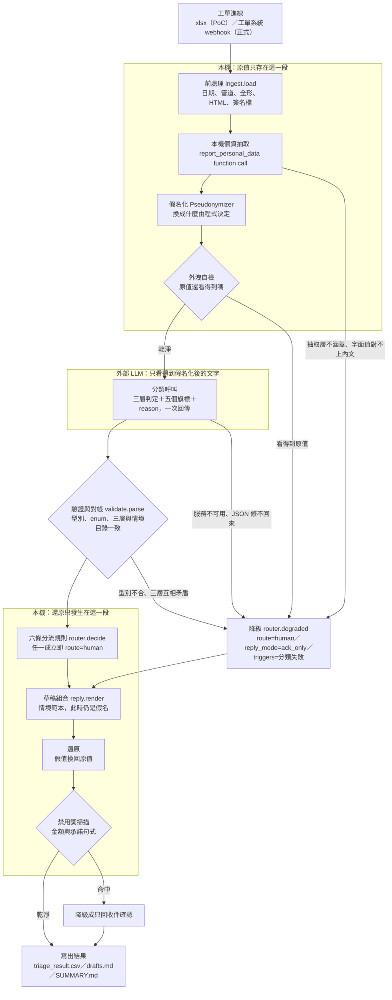

# 第二部分：方案設計

## Q3. 端到端 Workflow 設計

設計的核心：**模型只負責看懂這封信，程式負責決定要不要放行，人負責所有收不回來的動作。**

三層判定（受理判定、承辦歸屬、服務情境）、五個旗標（`is_complaint`、`is_irreversible`、`money_mentioned`、`residual_pii`、`confidence`）與一句 `reason`，由同一次 LLM 呼叫以單一 schema 產出。程式拿情境目錄核對它，再用六條規則決定分流。任何一步失敗都往同一個出口走：轉真人。

---

### 1. 任務流與資料流

順序不能換的地方有兩處。**個資在送出之前假名化**，所以抽取與假名化一定排在分類呼叫前面。**還原在寫出之前**，所以草稿是用假名組出來的，換回原值是寫檔前的最後一步。中間送出去的那一段，資料結構裡沒有可以放原值的欄位。

資料流有三個形態：

| 階段 | 內容 |
| --- | --- |
| 進線 | 原始工單，含原值 |
| 出本機 | 假名化文字，`prompt.ticket_text` 組出來的那一段 |
| 寫出去 | 分流結果加還原後的草稿 |

假名對照表是 `Pseudonymizer` 的實例屬性，處理完就隨實例消失，三個形態都不含它。

---

### 2. AI、規則、RAG、人工的分工邊界

| 角色 | 可以決定 | 不可以決定 |
| --- | --- | --- |
| **AI（外部 LLM）** | 這封信在講什麼、屬於哪些服務情境、是不是客訴、訴求是否涉及不可逆動作、提到什麼金額、自評信心 | 分流結果、要不要回覆、回什麼字、假名換成什麼值、自己的答案算不算有效 |
| **規則（程式）** | 分流、回覆型態、優先級、假名的選值、回應是否通過驗證、什麼時候降級、草稿能不能送出 | 語意判斷。程式不做任何「這封信在講什麼」的推論 |
| **RAG／知識庫** | 目前**沒有接**。將來只負責提供有出處的內容給草稿 | 分流。知識庫接上之後仍不參與任何 route 決策 |
| **人工** | 所有不可逆動作、所有客訴的實際回覆、判為不受理但有疑慮時要不要關單、以及每一封 `route=human` 的最終送出 | 無限制。人工是唯一有權執行收不回來的動作的角色 |

**模型填三層，程式核對三層。** 比較安全的做法是讓模型只選情境、受理判定與承辦歸屬由程式查表填，那樣永遠不會矛盾。我們刻意不這樣做：模型把一封博弈廣告判成「受理／客服」卻選了 `spam_fraud`，這個矛盾本身就是「它這次沒讀懂」的訊號。查表會把訊號抹掉，留下一個看起來很乾淨的錯答案（ADR 0003）。對帳矛盾直接當分類失敗轉真人，不修補。

**RAG 現在是空的，這是誠實的空。** 資訊部說知識文件散在共用資料夾的 Word、Excel 和一個沒人維護的舊 FAQ 網頁，版本很亂。在版本混亂的來源上做檢索，等於讓 AI 引用一份沒人知道對不對的規定。PoC 的草稿內容是情境範本，是模擬的，不是任何旅行社的真實規定。接上知識庫時只換掉草稿的內容來源：情境群組已經在 `catalog.py` 標好 `kb_search`，接線點是既有的。

**下游系統目前只標記不呼叫。** 情境群組決定這封信下游要查什麼：訂單 API、知識庫檢索、會員 API、工單系統轉單。CSV 的 `tools` 欄把它寫出來，但 PoC 不呼叫任何一個。訂單系統的 API 權限在開工時還沒核准。

---

### 3. 人工接手的觸發條件

**六條規則，全部在程式端判斷，任一成立就轉真人。** 沒有加權、沒有分數合成。要能對客服解釋「這封信為什麼進你的佇列」，答案必須是一條可以指著看的規則。

| # | 規則 | 判斷依據 | 在防什麼 |
| --- | --- | --- | --- |
| 1 | 情境需人工 | 該情境在情境目錄登記 `requires_human` | 這類事情本質上要查系統或要判斷，回罐頭等於沒回 |
| 2 | 客訴性質 | 模型判定這封信在責難本公司 | 客訴用範本回覆會把一件小事變成負評 |
| 3 | 非客服來信 | 承辦歸屬是 `referral` | 供應商報價、應徵、業配、媒體採訪被當客戶回覆 |
| 4 | 不可逆動作 | 情境登記 `irreversible`，或模型判定訴求涉及退款、開立文件、變更帳號、在既有訂單上加購或變更 | 系統執行了收不回來的動作 |
| 5 | 殘留個資 | 模型回報文字裡還看得到個資，扣掉我們自己放進去的假名之後仍有剩 | 抽取層漏抓，個資跟著往下游走 |
| 6 | 信心不足 | `confidence` 低於 0.6 | 模型自己都不確定的判斷被當成結論用 |

**四種降級路徑，一律轉真人，不退回關鍵字比對。**

| 降級原因 | 觸發點 | 在防什麼 |
| --- | --- | --- |
| 本機抽取層無法涵蓋 | `pii.ExtractionUnavailable`：這封工單不在標註範圍，或回報的字面值在內文裡找不到 | 沒假名化的內容被送出去 |
| 假名化後仍看得到原值 | `Pseudonymizer.leaked()`，送出之前的自我檢查 | 替換沒生效卻照樣送出 |
| 分類服務不可用 | `ClassifierUnavailable`：重試耗盡、JSON 修不回來、重跑的回應與現在的模型或 prompt 版本對不上 | 拿舊答案或空值假裝跑過 |
| 回應不合約定 | `InvalidAnswer`：型別錯、值不在 schema 的 `enum` 內、`confidence` 超出範圍、三層與情境目錄對帳矛盾 | 一個格式正確但內容矛盾的答案被當成結論 |

**判為不受理的工單也要過同一組規則。** 自動關單是這條管線唯一會讓工單消失的動作，所以只有六條全部沒成立才做。任一條成立就改成不回覆、但進人工佇列。人要確認它真的是廣告，而不是一封寫得很糟的真實客訴（ADR 0004）。

**禁用詞是第七道關卡，但它降級的是回覆型態不是分流。** 草稿寫出前掃一次金額數字與承諾句式（「已為您辦理」「將於 X 日」「同意退款」），命中就把 `template` 降成 `ack_only`。這條放在程式不在 prompt。「不亂承諾」的失敗成本是客訴，不能建立在模型每次都聽話的假設上。

**金額不參與分流決策。** 資深客服說「退款金額超過 30,000 元一定要主管簽核」。直覺會想加一條金額門檻，我們刻意不加（ADR 0002）。工單裡的金額是客戶自己打的字，不是系統值。拿它當門檻等於讓客戶自己決定要不要送簽核：少寫一個零就繞過了。而且客戶提到的數字經常不是本次交易金額，可能是他記錯的團費、是求償金額、是兩筆扣款通知的差額。真正的金額只有訂單系統知道，而訂單 API 的權限還沒下來。所以改成**所有不可逆動作一律轉真人**，金額只寫進 `money_mentioned` 欄供人工參考。代價是自動處理率明顯偏低，這是誠實的低。在拿不到權威金額之前，任何以金額為條件的規則都是把安全性建立在客戶的誠實上。

---

### 4. 錯誤處理與降級策略

**原則：便宜的修法先做，修不好就轉真人，絕不猜。** 降級的方向永遠是「交給人」，不是「換一個比較笨的自動判斷」。

| 失敗型態 | 系統怎麼辦 | 為什麼這樣做 |
| --- | --- | --- |
| 傳輸層錯誤（連線失敗、5xx、逾時） | 最多 3 次，間隔 1 秒、3 秒。耗盡就降級 | 一律視為暫時性。分不出來的錯誤重試比放行安全 |
| 額度用完（429） | 讀回應裡的 `RetryInfo.retryDelay` 等，等完清空節流視窗，**不計入重試次數**，最多等 2 次 | 額度是排隊不是錯誤。判斷依據是狀態碼與結構化欄位，不是錯誤訊息的字面內容 |
| 回應不是合法 JSON | 先用程式修：從最右邊的 `}` 往左切，每個候選都跑一次 schema 驗證。修不出來才呼叫 LLM 重出格式，最多 3 次，共用同一個驗收標準 | 程式修不花額度。驗證才是驗收標準，光是 `json.loads` 成功不算，半截的前綴也可能是合法 JSON 但欄位不全 |
| 模型鎖進重複輸出 | `max_output_tokens=800` 硬上限，`temperature=0.1` | 實際踩過：完全的 greedy decoding 讓模型鎖進重複輸出的迴圈，回了 65KB 的壞 JSON。正常回應約 140 token，給硬上限讓失控的那次快速失敗 |
| 回應合法但不合約定 | `validate.parse` 拋例外，降級轉真人，不修補任何欄位 | 三層互相矛盾代表這次判斷不可信，不是一個可以直接修好的欄位 |
| 沒有金鑰或需要重跑 | 讀既有回應檔，`model`、`prompt_version`、`input_digest` 三者必須全部一致，否則拋例外降級 | 少了這些檢查，改過 prompt 之後重跑會拿舊答案當新答案用，而且完全看不出來 |

**降級不會退回關鍵字比對。** 關鍵字表的錯誤是靜默的：TK-1011 是一封客訴信，客人在罵「跟博弈網站一樣」。關鍵字表會把它判成廣告然後自動關單，而這是這條管線唯一會讓工單消失的動作。轉真人的錯誤只是多花一個人的時間，關鍵字的錯誤是把客訴刪掉。兩者不是同一個量級。

**LLM 完全掛掉的那一天**，這套系統退化成「全部轉真人，每封信送出一則收件確認」。8 位客服的處理量回到現況，但首次回覆時間不會回到 6 小時。收件確認仍然在幾分鐘內發出。這是刻意設計的最壞情況：系統壞掉時，它壞成一個工單分派器，不壞成一個亂回信的機器人。

---

### 5. 個資與權限邊界

**法務的限制是「客戶個資不得傳輸到未經評估與簽約的外部服務」，而分類要用外部 LLM。解法是讓送出去的請求裡沒有可以放原值的欄位。**

四步，順序不能換（ADR 0001）：

1. **本機抽取。** 本機模型透過一次 function call（`report_personal_data`）回報「語意型別 + 原文字面值」。PoC 沒有本機模型，用人工標註模擬這個回應，但走的是完全相同的驗證路徑（`parse_tool_call`）。正式環境把 transport 換成真的 HTTP 呼叫，其餘程式不動。標註沒涵蓋、或回報的字面值在內文裡找不到，一律拋例外轉真人。
2. **程式挑假名。** 換成什麼完全由程式決定，不交給模型。程式看原值的字形挑替換方式：全大寫拼音換護照式拼音、大小寫英文換英文名、中文帶稱謂只換姓保留稱謂（陳先生換成王先生）、簡稱保留簡稱（小陳換成小李）、公司保留業別與組織型態（XX 巴士公司換成範例巴士公司）。拿掉的是身分，留下的是分類需要的線索。
3. **只送假名化後的內容。** 假名對照表是處理過程中的區域變數，不寫檔、不進日誌、不進請求。送出之前還有一道自我檢查：原值如果還出現在要送出的文字裡，這封信根本不送，直接降級。
4. **寫出前還原。** 草稿用假名組好才換回原值。CSV 的 `reason` 欄保留假名，只有 `drafts.md` 還原。

**為什麼這是結構上的保證而不是紀律上的承諾。** 送給外部服務的資料結構裡沒有可以放原值的欄位：`prompt.ticket_text()` 每一個承載工單文字的參數（寄件者、主旨、內文）都是 `Pseudonymizer.apply()` 的輸出。另外兩個參數是工單編號與來源管道，兩者都不是個資。要讓原值外流，得先改掉這個函式的呼叫端，那是一個看得見的 diff，不是一次疏忽。

**為什麼用假名而不是 `<PII_NAME_1>` 佔位符。** 佔位符更安全，但會傷到分類品質：客訴性質是靠語氣判斷的，「`<PII_NAME_1>` 您好，我想取消 `<PII_DATE_1>` 的行程」比一段自然的中文更難判斷訴求。假值一律用「王小明／王小美／範例公司」這種一看就知道是假的值，不自己編看起來很真的名字。值之間的相似關係也保留：TK-1028 的兩個護照英文名只差一個字母、TK-1010 的錯誤與正確統編只差最後一碼。換成兩個不相干的假值，等於在假名化的時候把客戶真正的問題消滅掉。

**權限邊界。** 情境群組決定這封信下游該查哪個系統，目前只標記在 CSV 的 `tools` 欄，不呼叫。接上真系統時的分界線是：`route=auto` 的工單只允許唯讀查詢（訂單狀態、知識庫檢索），所有寫入動作（送退款申請、變更訂單、變更帳號）只出現在人工介面上。系統本身不持有可以寫入的憑證。這條和第 4 條分流規則是同一件事的兩面：不可逆動作既不自動執行，也不給系統執行它的權限。

**一個誠實的缺口。** 存下來的回應檔存的是 `input_digest` 不是原文，所以檔案裡沒有工單內容。唯一的例外是模型回報的 `residual_pii` 欄位，它原樣寫進檔案，而且**48 個回應檔裡有 29 個這一欄不是空的**。寫進去的內容是我們自己放的假名：TK-1023 那一筆是 `["劉小美","B123456780","0900000001","001-000000000001"]`，四個值全部出自 `pii.py` 的假值池。`pipeline.py` 用 `masked.covers()` 扣掉之後，真正的殘留個資是 0 件，第 5 條規則一次都沒被觸發。

問題在於這個欄位的寫入路徑不分真假：模型回報什麼就寫什麼。抽取層哪天真的漏抓一筆，那個片段會沿著同一條路徑寫進檔案，而且不會有任何訊號。接真流量前必須把它改成只寫型別不寫值，做法和 `Pseudonymizer.leaked()` 一樣。這件事比「殘留個資 0 件」這個數字給人的印象更急：那個 0 是過濾器擋下來的結果，不是這一欄本來就乾淨。

---

### 6. Log 與追蹤點

**記錄的位置有三個，各自回答不同的問題。**

| 位置 | 記什麼 | 之後可以回答什麼 | 餵給哪一類指標 |
| --- | --- | --- | --- |
| `data/responses/<ticket_id>.json` 每封工單一個檔 | `model`、`prompt_version`、`input_digest`、input／output token 數、模型的完整原始回應 | 「這一筆當初為什麼被這樣分？」「這個結果是哪個 prompt 版本跑的？」「一封信花多少 token？」 | 成本、版本歸因（任何指標都要能按 prompt 版本切開看） |
| `triage_result.csv` 每封工單一列 | `route`、`reply_mode`、`priority`、`triggers`、`scenarios`、`confidence`、`is_complaint`、`tools`、`pii_count`、`banned_hits`、`money_mentioned`、`reason` | 「哪些信轉了真人、是被哪一條規則轉的？」「回了範本還是只回收件確認？」「哪些草稿被禁用詞攔下來？」 | 人工接手率、任務成功率的分母切分、錯誤率、防護型指標 |
| `SUMMARY.md` 每次執行一份 | 情境分佈、群組分佈、分流分佈、回覆型態分佈、各條觸發規則的命中數、前處理修掉的雜訊筆數、疑似重複來信、禁用詞攔截件數 | 「這一批的整體樣貌和上一批比有沒有漂移？」 | 批次層級的比較基準 |

**每一個紀錄點的設計理由。**

1. **`triggers` 欄是複數，記全部命中的規則不是第一條。** 只記第一條的話，永遠看不出來六條規則裡有幾條是白寫的。48 筆的實際結果是：轉真人的 34 筆全部命中「情境需人工」，其他五條沒有一筆單獨生效。這個事實只有在 `triggers` 記全部時才看得到，它說明其他五條是多層防護不是獨立來源。
2. **`reason` 欄同時記程式的判斷和模型的一句話。** 格式是「轉真人（觸發的規則）。模型對這封信的理解」。客服看到這封信在自己的佇列裡時，一行就知道是誰、要什麼、以及為什麼是他來處理。
3. **只記 `input_digest`，不記輸入原文。** 回應檔要能證明「這個答案對應的是這段內容」，但不需要把內容再存一份。digest 做得到前者，做不到後者，所以選它。
4. **`banned_hits` 欄記命中的字串。** 它是唯一能回答「模型有多常想亂承諾」的資料。這一欄如果開始上升，代表 prompt 或模型換版之後行為漂移了，而且是往客訴的方向漂。
5. **刻意不記的東西：假名對照表、任何個資原值。** 降級訊息也只寫型別不寫值（「假名化後仍偵測到 person_name 的原值」），因為那句話會進 CSV 的 `reason` 欄，寫原值等於把個資寫進檔案。

**待補的紀錄點，三個。** 回應檔目前只有六個鍵：`ticket_id`、`model`、`prompt_version`、`input_digest`、`usage`、`answer`。下面這三件事現在沒有任何地方記，Q4 要算的指標有一部分建立在它們上面，所以要在試營運開始前補完。

| 待補的紀錄點 | 現在為什麼算不出來 | 補了之後可以算什麼 |
| --- | --- | --- |
| 時間戳 | 回應檔沒有呼叫的開始與結束時間，CSV 也沒有處理時間欄。工單的 `created_at` 有記，缺的是另一端 | 單封處理時間、端到端首次回覆時間。要補三個點：工單進線、草稿產出、真人送出。前兩個由這條管線寫，第三個要從工單系統的 API 取 |
| 重試與節流等待 | `gemini.py` 的重試次數、429 的等待秒數、節流器讓出的時間都只發生在記憶體裡，沒有寫出去 | 每封信實際等了多久、額度是不是瓶頸。旺季翻倍時這是第一個會撞到的東西 |
| 降級事件 | 降級目前只在 CSV 的 `triggers` 欄留下「分類失敗」，原因寫在 `reason` 欄的自由文字裡。而且**分類呼叫之前就降級的兩條路徑（抽取層未涵蓋、假名化後仍看得到原值）根本不會產生回應檔** | 降級率、以及降級是由哪一條路徑造成的。現在要回答「這週有幾封是抽取層擋下來的」只能用字串比對 `reason` 欄 |

時間戳這件事必須排第一：首次回覆時間從 6 小時降到多少是這個案子的主要賣點，沒有那三個時間戳就沒有數字。

---

*指標的分子分母、資料來源與上線 Gate 見 Q4。*
